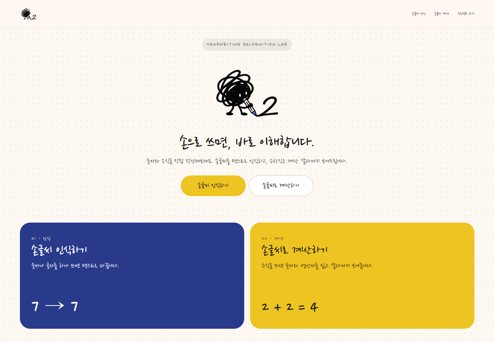

# 손글씨 인식 · 계산 서비스

손으로 쓴 숫자와 수식을 이해하고, 텍스트로 바꾸거나 계산 결과까지 보여주는 웹 서비스입니다.

> 손으로 쓰면, 바로 이해합니다.



화면에 글씨를 쓰면 AI가 내용을 읽습니다. 글자만 필요할 때는 텍스트로 변환하고, 수식이면 `2 + 2 = 4`처럼 계산까지 합니다.

## 무엇을 하나요

서비스는 두 가지로 나뉩니다.

### 손글씨 인식 (`/recognize`)

숫자나 글자를 캔버스에 쓰고 **텍스트로 변환**을 누르면 인식 결과를 보여줍니다.

- 손글씨 `7` → `7`
- 손글씨 `A` → `A`

### 손글씨 계산 (`/calculate`)

수식을 쓰고 **계산하기**를 누르면 숫자와 연산자를 읽은 뒤 결과를 계산합니다.

- 손글씨 `2+2` → 인식 `2 + 2` → `2 + 2 = 4`

랜딩(`/`)에서 두 기능 중 원하는 작업을 고를 수 있습니다.

## 사용한 기술

| 구분 | 기술 |
|---|---|
| 프론트엔드 | Next.js 16 (App Router), React 19, TypeScript |
| 스타일 | Tailwind CSS 4, Nanum Pen Script |
| 손글씨 인식 | Google Gemini (`gemini-2.5-flash`) 비전 API |
| 계산 | 브라우저에서 사칙연산(`+ - × ÷`, 괄호)을 직접 계산 |
| 디자인 | Google Stitch로 만든 화면을 웹으로 구현 |
| 실행 환경 | Node.js, `.env`의 `GEMINI_API_KEY` |

손글씨 이미지는 서버 라우트 `/api/recognize`로만 보내고, API 키는 브라우저에 노출되지 않습니다.

## 실행 방법

```bash
npm install
```

프로젝트 루트의 `.env`에 Gemini API 키를 넣습니다.

```env
GEMINI_API_KEY=여기에_키
```

```bash
npm run dev
```

브라우저에서 [http://localhost:3000](http://localhost:3000)을 엽니다.

| 경로 | 화면 |
|---|---|
| `/` | 랜딩 |
| `/recognize` | 손글씨 인식 |
| `/calculate` | 손글씨 계산 |

키를 바꾼 뒤에는 개발 서버를 다시 켜야 합니다.
